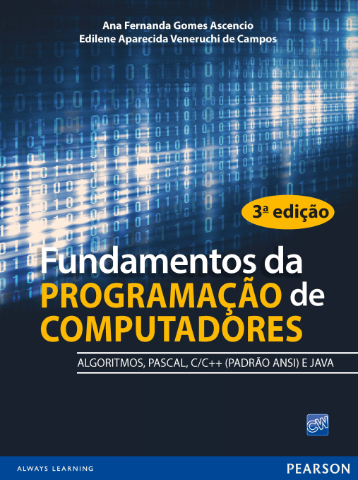

#### Repositório contendo as listas de exercícios do livro:
#### "Fundamentos da programação- Pascal, C C+ java" 
#### Para a disciplina de Algoritmos I do IFMG - Campus Formiga

* Lista 01 : Estrutura Sequencial 
  * Cap.03 - Resolvidos e Propostos
* Lista 02 : Estrutura Condicional 
  * Cap.04 - Resolvidos
* Lista 03 : Estrutura Condicional 
  * Cap.04 - Propostos
* Lista 04 : Estrutura de Repetição 
  * Cap.05 - Resolvidos
* Lista 05 : Estrutura de Repetição 
  * Cap.05 - Propostos
* Lista 06 : Vetores 
  * Cap.06 – Resolvidos e Propostos
* Lista 07 : Matrizes 
  * Cap.07 – Resolvidose Propostos
* Lista 08 : Sub-rotinas 
  * Cap.08 – Resolvidose Propostos
* Lista 09 : Registros (Structs) 
  * Cap.10 – Resolvidos
* Lista 10 : Registros (Structs) 
  * Cap.10 – Propostos

